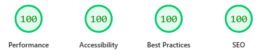
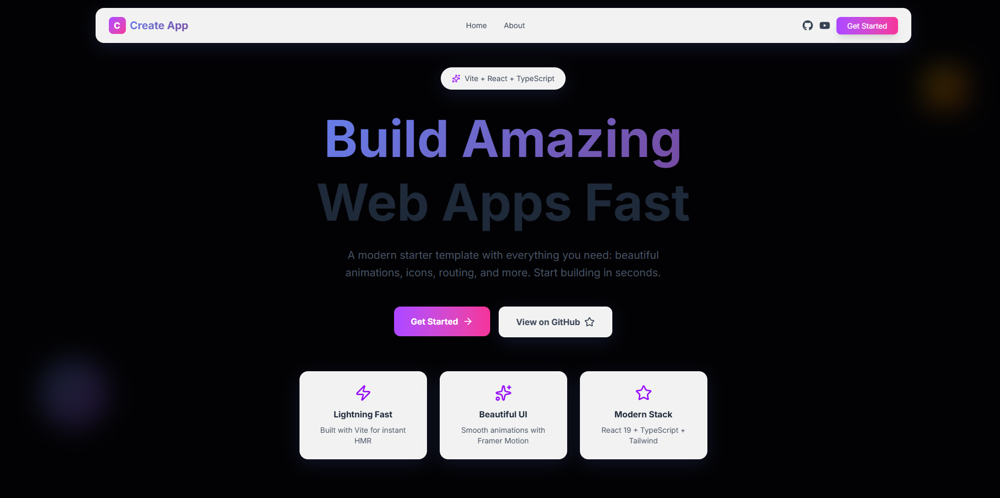
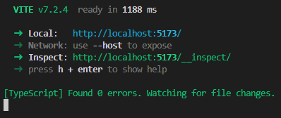
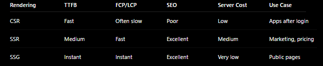

# ⚡ Vite React SSG Pro Template

> **Note:** Some files (such as config, scripts, or generated files) may be hidden in your editor due to workspace settings in `.vscode/settings.json`. If you don't see a file, check your folder and VS Code settings.

> **Note:** This template is a static site generator (SSG) that prerenders all routes to static HTML at build time. It does not provide runtime SSR (server-side rendering). All output is fully static and deployable to any static host.



> **Skip days of setup. Ship production-ready React apps with perfect SEO and zero backend costs.**

A battle-tested Vite + React template that generates **fully static sites** with server-side rendering (SSR) benefits - but **no servers** (SSG), no complexity, just pure performance that Google loves.



## 📄 License

**Commercial License** - You purchased this template, so you can:

- ✅ Use in unlimited personal and commercial projects
- ✅ Build client websites for profit
- ✅ Create SaaS products with paid subscriptions
- ✅ Use in closed-source applications
- ✅ Modify and customize freely
- ✅ No attribution required
- ✅ **Maintained & Updated** - Get the latest features and fixes
- ✅ **Priority Support** - Direct help when you need it

**Free MIT version**: https://github.com/burgil/create-app (legacy, unmaintained)  
**Commercial License**: https://payhip.com/burgil

---

## 🎯 Quick Start

```bash
# Install dependencies
pnpm install

# Start dev server (instant HMR)
pnpm dev

# Build for production (includes SSG)
pnpm build

# Preview production build
pnpm preview

# Optional: OG screenshot generation
pip install -r scripts/requirements.txt
playwright install
pnpm og-screenshots
```



---

## 🚀 Why This Template is Epic

### The Problem We Solve
Most React apps fail at SEO because they're client-side rendered. Traditional SSR solutions require Node.js servers ($$$) and complex infrastructure. This template gives you the **best of both worlds**:

✅ **Perfect SEO** - Pre-rendered HTML for every page  
✅ **Lightning Fast** - Static files served from CDN  
✅ **Zero Backend** - Deploy anywhere (Cloudflare, Vercel, Netlify)  
✅ **Free hosting** - Static hosting is practically free  
✅ **Google Loves It** - Perfect Lighthouse scores out of the box  

### What Makes This Different



| Feature | This Template | Typical React App | Next.js |
|---------|--------------|-------------------|---------|
| **Learning Curve** | 🟢 Easy | 🟢 Easy | 🟡 Medium |
| **Server Required** | ❌ No | ❌ No | ✅ Yes |
| **Hosting Cost** | $0/mo | $0/mo | $20+++/mo |
| **SEO-Ready** | ✅ Pre-rendered | ❌ Client-side | ✅ Yes |
| **Page Speed** | ⚡ Fast | ⚡ Fast | 🐌 Slow |
| **Build Speed** | ⚡ Instant | ⚡ Fast | 🐌 Slow |
| **Deploy Anywhere** | ✅ Yes | ✅ Yes | ⚠️ Limited |

---

## 📦 What's Inside

- **Vite 7** - Sub-100ms HMR, instant dev server startup
- **React 19** - Latest features with full TypeScript support
- **Tailwind CSS 4** - Modern utility-first styling
- **React Router 7** - File-based routing with lazy loading
- **Framer Motion** - Smooth animations that feel native
- **Lucide Icons + React Icons** - Beautiful icon libraries
- **Pre-rendering** - Automatic SSG for perfect SEO
- **OG Image Generation** - Auto-generate Open Graph images
- **Schema.org** - Rich snippets for better search results

---

## 🏗️ Architecture Highlights

### Pre-rendering Magic
Every page is pre-rendered at build time with full HTML, meta tags, and structured data. Crawlers see fully-formed content instantly - no JavaScript execution needed.

```typescript
// Your React components render to static HTML
<Hero /> → <section>...fully rendered HTML...</section>
```

### SEO Superpowers
- ✅ **Meta tags** automatically injected per route
- ✅ **Open Graph** images for social sharing
- ✅ **Schema.org** structured data (Organization, WebSite, Breadcrumbs)
- ✅ **Sitemap generation** with proper priorities
- ✅ **Canonical URLs** to prevent duplicate content

### Performance by Default
- ⚡ **Critical CSS inlining** - 40-50 KB inlined via Beasties (99%+ external CSS reduction)
- ⚡ **Terser minification** - 3-pass compression with aggressive mangling
- ⚡ **Code splitting** - Vendor chunks for React, Framer Motion, and icons
- ⚡ **Lazy loading** - Routes and components load on-demand
- ⚡ **Dual compression** - gzip + brotli for all assets
- ⚡ **Font optimization** - Zero CLS with font-display: optional
- ⚡ **CDN-ready** - Serve from edge locations worldwide

---

## 📊 Real-World Results

```
Mobile PageSpeed: 100/100
Desktop PageSpeed: 100/100
First Contentful Paint: <0.5s
Largest Contentful Paint: <2.5s
Cumulative Layout Shift: 0
SEO Score: 💯 100/100
```

---

## 🛠️ Tech Stack

| Category | Technology |
|----------|-----------|
| **Build Tool** | Vite 7.2 |
| **Framework** | React 19.2 |
| **Language** | TypeScript 5.9 |
| **Styling** | Tailwind CSS 4.1 |
| **Router** | React Router 7.9 |
| **Animation** | Framer Motion 12 |
| **Icons** | Lucide React 0.5 + React Icons 5.5 |
| **Linting** | ESLint 9 + TypeScript ESLint |
| **Package Manager** | pnpm 10 |

---

## 🚀 Deploy Anywhere

This template generates **100% static files**. Deploy to:

- **Cloudflare Pages** - Free, blazing fast edge network
- **Vercel** - Zero config deployment
- **Netlify** - Instant Git integration
- **GitHub Pages** - Free hosting for open source
- **Any static host** - Upload dist/ folder, done

No serverless functions, no Node.js runtime, no hidden costs.

---

## 📚 Documentation

- **[Getting Started](docs/getting-started.md)** - Your first 5 minutes
- **[Architecture Guide](docs/architecture.md)** - How everything works
- **[SEO Best Practices](docs/seo-guide.md)** - Maximize your search rankings
- **[Deployment Guide](docs/deployment.md)** - Ship to production in minutes
- **[Performance Optimization](docs/performance.md)** - Make it even faster
- **[Optimization Guide](docs/optimize.md)** - Advanced performance optimizations
- **[React Suspense Guide](docs/suspense-guide.md)** - Lazy-loading patterns
- **[Customization Guide](docs/customization.md)** - Make it yours
- **[UI/UX Guidelines](docs/ui-ux-guidelines.md)** - Design best practices

---

## 🎨 Example Pages Included

### Home Page
Shows off Framer Motion animations, Lucide icons, and modern design patterns.

### About Page
Demonstrates TypeScript best practices, component composition, and accessible UI.

### Suspense Example Page
Interactive demonstration of React Suspense patterns including lazy loading, skeleton fallbacks, and performance optimization techniques.

---

## 💡 Use Cases

Perfect for:
- 🌐 **Marketing sites** - Maximize conversions with perfect SEO
- 📱 **Landing pages** - Ship fast, iterate faster
- 📝 **Portfolios** - Showcase your work with style
- 📊 **Product pages** - Convert visitors to customers
- 🎓 **Documentation sites** - Fast, searchable, accessible

---

## 🌟 Community & Support

- **GitHub**: [@burgil](https://github.com/burgil)
- **YouTube**: [@GenZv1Dev](https://youtube.com/@GenZv1Dev)
- **Commercial Support**: Priority support for license holders

---

## 🎯 Next Steps

1. **Read** [Getting Started](docs/getting-started.md) to build your first page
2. **Customize** colors, fonts, and content in `tailwind.config.js` and `src/`
3. **Deploy** to Cloudflare Pages or Vercel (takes 2 minutes)
4. **Ship** your epic project to the world 🚀

---

## 🔄 Updating Dependencies

To update all dependencies to their latest versions, run:

```bash
pnpm upgrade --latest
```

This will update your package.json and lockfile to the newest compatible versions.

---

**Built with ❤️ for developers who want to ship fast without compromising on quality.**
